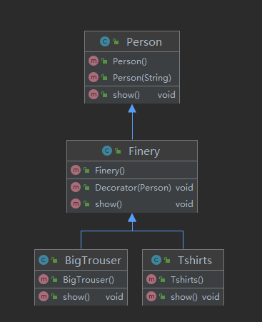

### 定义：装饰器模式又名包装(Wrapper)模式。装饰器模式以对客户端透明的方式拓展对象的功能，是继承关系的一种替代方案。

- 抽象构件(Component)角色：给出一个抽象接口，已规范准备接收附加责任的对象。
- 具体构件(ConcreteComponent)角色：定义一个将要接收附加责任的类
- 装饰(Decorator)角色：持有一个构件(Component)对象的实例，并定义一个与抽象构件接口一致的接口。
- 具体装饰(ConcreteDecorator)角色：负责给构件对象“贴上”附加的责任。

### 一个简单的装饰器模式UML图(我这里没有使用接口)

#### 这里其实就是finery持有了person实例，通过show方法来进行装饰。实现的比较简单
- Java的IO相关类则大量使用了装饰器模式
